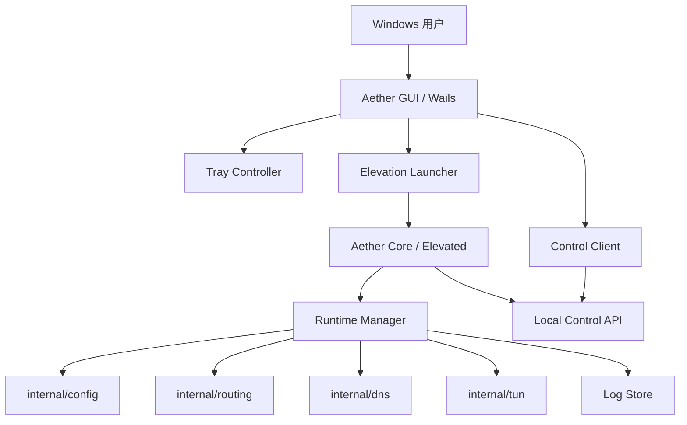

# Aether GUI MVP 设计文档

## 概述

本设计的目标是把当前“可运行但偏命令行原型”的 Aether，升级成适合新手用户的 Windows 桌面应用。MVP 范围严格控制在“控制层”而不是“配置器”：提供安装版 GUI、启动/停止代理、关闭窗口最小化到托盘、托盘快捷操作、状态展示、日志查看、打开配置文件与开机自启入口。首版不在 GUI 中编辑复杂配置，不做规则管理，不做连接统计大盘。

最终用户感知上是一个应用，但实现上拆成两个进程：`Aether GUI` 和 `Aether Core`。GUI 负责窗口、托盘与用户交互；Core 负责复用现有 TUN / DNS / Routing 逻辑并以提权方式运行。这样可以保留当前 Go 网络核心，避免把权限、窗口生命周期和底层网络行为揉进一个进程里，也能让 GUI 在未提权场景下正常运行。

设计上的关键决策如下：

1. **GUI 框架**：使用 `Wails v2.11.0` 作为稳定桌面壳，而不是直接押注 `Wails v3 alpha`。
2. **托盘实现**：托盘使用独立 Windows 托盘控制层接入；原因是 `Wails v3` 有官方 `SystemTray` API，但截至 `2026-03-06` 仍属于 alpha 线，MVP 更适合采用稳定的 `Wails v2` 窗口能力，再补托盘能力。
3. **启动模型**：GUI 普通权限运行；点击“启动代理”时，通过 Windows UAC 拉起提权后的 `aether-core`。
4. **控制协议**：GUI 与 Core 通过本机回环地址上的受限 HTTP 控制接口通信，避免首版就引入命名管道复杂度。

## 与现有仓库的一致性

### 技术约束

当前仓库没有 `.spec-workflow/steering/*.md` 内容，因此本设计以现有代码组织和运行方式为准：

- 保留 `Go` 单模块仓库结构；
- 优先复用 `internal/config`、`internal/dns`、`internal/routing`、`internal/tun`；
- 尽量把新能力做成外围适配层，而不是重写 TUN / DNS 核心；
- 保留命令行入口，方便调试与回归验证。

### 目录演进原则

为了同时保留现有 CLI 和新增 GUI，本设计建议把当前根目录入口改造成 GUI，并把现有 CLI 迁移到 `cmd/aether-cli`，新增提权后台入口 `cmd/aether-core`。这样做之后：

- `go build .` / `wails build` 面向最终桌面用户；
- `go build ./cmd/aether-cli` 继续面向开发调试；
- `go build ./cmd/aether-core` 面向 GUI 提权拉起。

## 代码复用分析

### 直接复用的现有模块

- **`internal/config/config.go`**：继续负责默认配置、加载与保存；只补运行时路径选择和首次启动落盘逻辑。
- **`internal/dns/server.go`**：继续作为 FakeIP DNS 服务实现；需要外层生命周期管理与日志接入。
- **`internal/routing/engine.go`**：继续负责路由判定，无需改协议语义。
- **`internal/tun/engine.go`**：继续负责 Wintun、gVisor、TCP/UDP 转发；需要从“直接在 `main.go` 启动”改成“由运行时管理器统一编排”。
- **`wintun_embed.go`**：继续负责 `wintun.dll` 释放逻辑。

### 新增的外围模块

- **运行时编排层**：把现有 `main.go` 中的“加载配置 → 初始化 router/dns/tun → 启动 → 停止”抽到 `internal/runtime`。
- **控制协议层**：新增 `internal/control`，为 GUI 提供 `status`、`stop`、`recent logs` 等只读/控制能力。
- **桌面交互层**：新增 GUI 后端绑定、托盘控制器、UAC 启动器、日志聚合器和 Windows 路径管理。

### 数据落点

安装版二进制建议位于 `%ProgramFiles%\Aether\`，但**运行时数据不放在安装目录**，否则“打开配置文件”会碰到权限问题。MVP 建议采用：

- 配置：`%LocalAppData%\Aether\config.json`
- 日志：`%LocalAppData%\Aether\logs\*.log`
- 运行时状态：`%LocalAppData%\Aether\run\`

这样 GUI 以普通权限也能打开配置与日志，Core 提权后同样能读取同一套路径。

## 架构

### 总体架构



### 模块职责

1. **GUI 进程**
   - 提供主窗口、托盘与快捷入口；
   - 轮询 / 订阅 Core 状态；
   - 在启动时完成前置检查；
   - 通过 UAC 拉起 Core；
   - 通过本地控制接口触发停止、拉取日志。

2. **Core 进程**
   - 加载配置；
   - 启动和停止 TUN / DNS / 路由引擎；
   - 暴露本地控制接口；
   - 聚合结构化状态和最近日志；
   - 维护启动中、运行中、停止中、失败等状态机。

3. **本地控制接口**
   - 默认只监听 `127.0.0.1` 上随机高位端口；
   - GUI 通过启动参数或运行时状态文件获得端口与会话 token；
   - 所有请求都携带一次会话 token，避免其他本地进程随意停止 Core。

### 关键设计决策

#### 1. 使用 `localhost HTTP` 而不是命名管道

MVP 优先开发效率和可调试性。回环 HTTP 的优势是：

- 调试简单，可用 `curl` 或浏览器复现；
- Go 标准库即可完成，无需额外 Windows IPC 包装；
- GUI 端与 Core 端都更易单测和集成测。

命名管道可以作为后续强化项；如果后期需要更严格的本地安全边界，再做替换。

#### 2. GUI 不直接内嵌 TUN 核心

虽然单进程实现更快，但会引入三个问题：

- GUI 必须长期管理员权限运行；
- 窗口崩溃会直接连带代理核心中断；
- 窗口生命周期和网络资源释放强耦合，难以做托盘常驻。

因此采用“普通权限 GUI + 提权 Core”更符合桌面代理工具的长期演进。

#### 3. 稳定优先：`Wails v2` + 独立托盘层

截至 `2026-03-06`，`Wails v2.11.0` 是最新稳定版，`Wails v3 alpha` 已有官方托盘 API，但不适合作为安装版 MVP 的基础。MVP 采用稳定窗口栈，加一层托盘控制器，风险更低。

## 组件与接口

### `internal/runtime.Manager`

- **目的**：统一管理配置加载、依赖初始化、生命周期和状态机。
- **主要接口**：
  - `Start(ctx context.Context) error`
  - `Stop(ctx context.Context) error`
  - `Status() RuntimeStatus`
  - `Subscribe(chan<- RuntimeStatus)`
- **依赖**：`config.Config`、`dns.Server`、`routing.Engine`、`tun.Engine`、`logs.Store`
- **复用点**：直接复用现有 TUN / DNS / Routing 构造逻辑。

### `internal/control.Server`

- **目的**：暴露 GUI 所需的最小本地控制面。
- **主要接口**：
  - `GET /v1/status`
  - `GET /v1/logs/recent?limit=50`
  - `POST /v1/stop`
  - `GET /v1/meta`
- **依赖**：`runtime.Manager`、`logs.Store`
- **安全措施**：仅监听 `127.0.0.1`，校验会话 token。

### `internal/launcher`

- **目的**：封装 Windows 提权拉起、单实例检查和运行中 Core 发现。
- **主要接口**：
  - `LaunchElevatedCore(configPath string) (LaunchResult, error)`
  - `FindRunningCore() (*CoreLocator, error)`

### GUI 后端绑定

- **目的**：作为 Wails Go 后端与前端桥接层。
- **主要接口**：
  - `GetStatus()`
  - `StartCore()`
  - `StopCore()`
  - `GetRecentLogs(limit int)`
  - `OpenConfigFile()`
  - `OpenLogDirectory()`
  - `SetAutoStart(enabled bool)`

### 托盘控制器

- **目的**：管理托盘图标、菜单文案和主窗口显隐。
- **交互**：
  - 双击：打开主窗口
  - 右键：`启动代理 / 停止代理 / 打开 Aether / 查看日志 / 开机自启 / 退出`

## 数据模型

### `RuntimeStatus`

```go
type RuntimeStatus struct {
    Phase          string    // stopped | starting | running | stopping | error
    PID            int
    Elevated       bool
    StartedAt      time.Time
    ConfigPath     string
    ProxyEndpoint  string
    TunAdapterName string
    LastErrorCode  string
    LastErrorText  string
}
```

### `RecentLogEntry`

```go
type RecentLogEntry struct {
    Time    time.Time
    Level   string
    Source  string
    Message string
}
```

### `AppPaths`

```go
type AppPaths struct {
    ConfigFile string
    LogDir     string
    RuntimeDir string
}
```

## 关键交互流

### 启动流

1. GUI 启动后读取 `AppPaths`，如果配置文件不存在则根据 `config.DefaultConfig()` 生成默认配置。
2. GUI 查询本地是否已有 Core 在运行。
3. 用户点击“启动代理”。
4. GUI 做前置校验：配置文件存在、JSON 可解析、代理主机与端口格式有效。
5. GUI 通过 UAC 启动 `aether-core`，附带 `configPath`、会话 token 和控制端口信息。
6. Core 进入 `starting` 状态并按顺序启动 `routing`、`tun`、`dns`。
7. Core 启动成功后，GUI 切换为 `running`，托盘菜单同步变更为“停止代理”。

### 停止流

1. 用户点击 GUI 主按钮或托盘中的“停止代理”。
2. GUI 向 Core 的 `POST /v1/stop` 发送请求。
3. Core 进入 `stopping`，按顺序停止 DNS、TUN、路由与资源。
4. Core 返回 `stopped` 状态并退出。
5. GUI 刷新首页状态，主按钮恢复“启动代理”。

### 关闭窗口流

1. 用户点击窗口关闭按钮。
2. GUI 拦截关闭行为，隐藏窗口，不退出进程。
3. 首次触发时弹出一次提示：“Aether 已最小化到系统托盘，仍可在后台运行。”

## 错误处理

### 错误场景

1. **用户拒绝 UAC**
   - **处理**：GUI 将状态回退为 `stopped`。
   - **用户提示**：`需要管理员权限才能启动代理。`

2. **配置文件不存在或 JSON 损坏**
   - **处理**：启动前校验直接失败，不拉起 Core。
   - **用户提示**：`配置文件无效，请打开配置文件修复后重试。`

3. **代理上游不可达**
   - **处理**：Core 记录错误并进入 `error`。
   - **用户提示**：`无法连接到本地代理，请确认 V2RayN / Clash 已启动。`

4. **Wintun / 网卡初始化失败**
   - **处理**：Core 立即停止已启动组件并返回错误码。
   - **用户提示**：`TUN 初始化失败，请查看日志。`

5. **已有 Core 正在运行**
   - **处理**：GUI 不再重复拉起，直接连接已有 Core。
   - **用户提示**：`代理已在运行。`

6. **GUI 与 Core 失联**
   - **处理**：GUI 将状态标为 `unknown`，自动重试探测若干次。
   - **用户提示**：`后台核心连接中断，请重试或重新启动 Aether。`

## 测试策略

### 单元测试

- `internal/runtime`：状态机、启动/停止顺序、错误回滚；
- `internal/control`：HTTP 接口、token 校验、错误码；
- `internal/logs`：最近日志缓存与文件落盘；
- `internal/paths`：Windows 路径解析；
- GUI 后端控制器：在 fake client 下验证按钮行为与状态映射；
- React 组件：状态渲染、按钮禁用、日志面板显示。

### 集成测试

- 用 fake runtime 启动本地控制接口，验证 GUI 后端绑定到控制接口的调用链；
- 启动 `aether-core` 的“假运行时模式”，验证 GUI 的启动/停止/日志刷新逻辑；
- 验证配置文件首次生成与错误配置提示。

### Windows 手工冒烟

- 普通权限启动 GUI；
- 点击“启动代理”时弹出 UAC；
- 启动成功后关闭窗口，确认缩到托盘；
- 托盘右键停止代理；
- 从托盘重新打开主窗口；
- 安装版完成安装、卸载、开始菜单、桌面快捷方式验证。

## 实施边界

本次 MVP **不做**以下内容：

- GUI 内编辑复杂配置；
- 规则管理器；
- 实时连接统计图表；
- Windows Service 常驻；
- 命名管道 IPC；
- 自动更新。

这些内容都留给第二阶段，在当前“控制型桌面应用”稳定后再扩展。

## 参考资料

- Wails v2 文档（窗口隐藏与关闭行为）：https://wails.io/docs/reference/options/
- Wails 官方 GitHub Releases（`v2.11.0` 稳定版）：https://github.com/wailsapp/wails/releases
- Wails v3 alpha `SystemTray` 文档（用于对比，不作为本次 MVP 基础）：https://v3alpha.wails.io/learn/systray/
- `github.com/getlantern/systray` 发布页（用于托盘依赖评估）：https://github.com/getlantern/systray/releases
